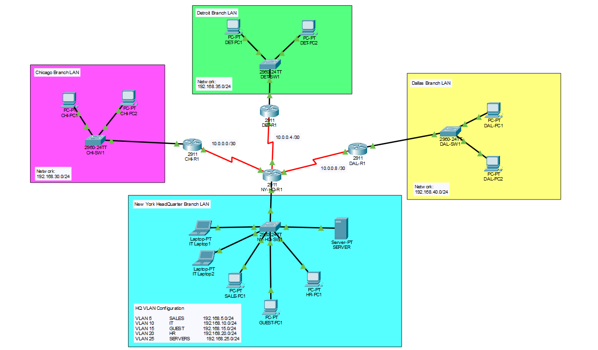
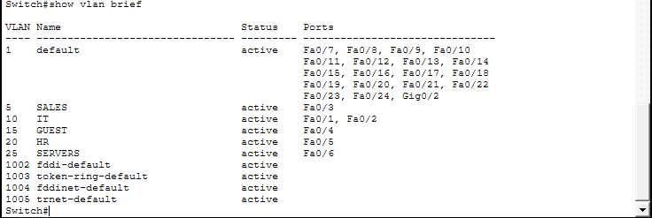
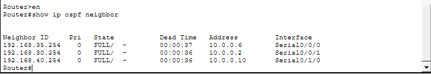
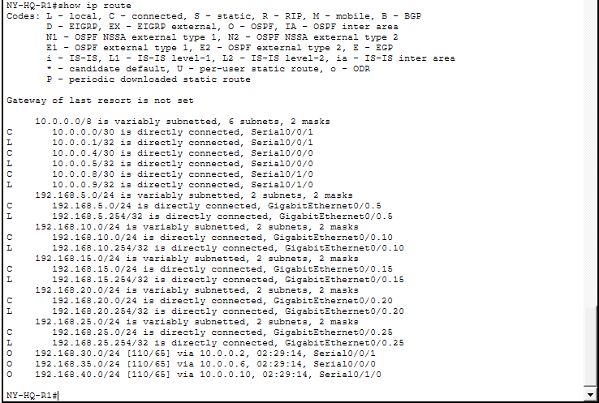
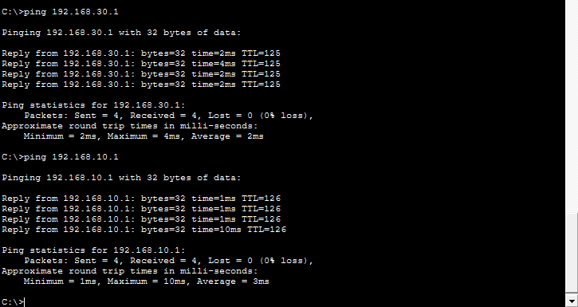

# Enterprise Network Lab

## Overview
This project simulates a multi-site enterprise network using VLAN segmentation, inter-VLAN routing, and OSPF dynamic routing. The network includes a headquarters site in New York and three branch offices connected through WAN serial links. The topology was designed and configured in Cisco Packet Tracer to demonstrate enterprise network design, subnetting, VLAN implementation, and dynamic routing between geographically separated locations.

## Topology

## Features
- VLAN segmentation for department isolation
- Inter-VLAN routing via Router-on-a-Stick
- OSPF dynamic routing across all sites
- WAN connectivity between HQ and branch offices
- Structured subnetting and IP addressing

## Technologies Used
- Cisco Packet Tracer
- OSPF Routing Protocol
- VLANs and Trunking
- Cisco Routers and Switches
- PCs, laptops, and servers
- Straight-through and serial cables

## Network Validation
- Full end-to-end connectivity between all sites
- Successful OSPF neighbor relationships
- Verified dynamic route propagation
- Inter-VLAN communication at HQ

## Screenshots

### VLAN Configuration

### OSPF Neighbors

### Routing Table

### Connectivity Tests

